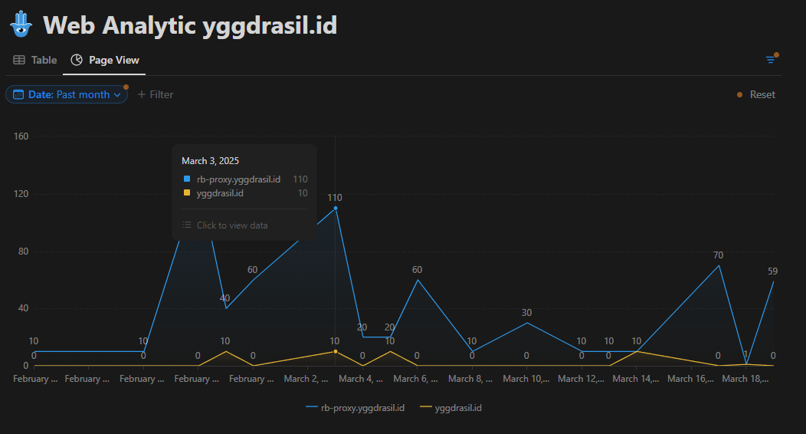
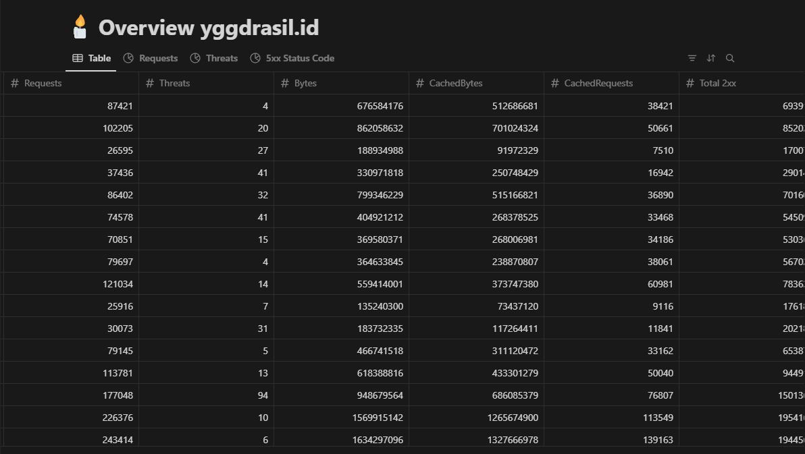

# StoreFlare


## 🚀 Overview
StoreFlare is an automated data processing tool designed to handle multiple data formats seamlessly. It provides an efficient pipeline to process **Notion**, **JSON**, and **SQLite** data formats using scheduled GitHub Actions automation.

This project is an implementation of **[Cloudflare Metric](https://github.com/k1m0ch1/cloudflare-metric)**, designed to enhance the processing and tracking of Cloudflare-related metrics in different formats.

I just store the data with Notion, and you could see here https://storeflare.notion.site/ or https://storeflare.notion.site/Overview

<p align="center">
    
    
</p>

## ⚙️ Features
- ✅ **Automated Data Processing**: Runs scheduled jobs to process Notion, JSON, and SQLite data.
- 🔄 **GitHub Actions Integration**: Executes commands every **12 hours** with continuous execution, even if a previous job fails.
- 📌 **Version Control**: Commits and pushes changes automatically upon successful execution.

## 🛠️ How It Works
This repository leverages **GitHub Actions** to run three separate jobs sequentially:

```bash
python storeflare/cli.py notion  # Runs Notion processing
python storeflare/cli.py json    # Runs JSON processing
python storeflare/cli.py sqlite  # Runs SQLite processing
```

If **any job succeeds**, the changes are committed and pushed to the `master` branch with a commit message:

```bash
cronjob YYYY-MM-DD HH:MM:SS
```

## 🏃‍♂️ Running Locally
To test the project locally, follow these steps:

```bash
git clone https://github.com/k1m0ch1/StoreFlare.git
cd StoreFlare
python -m venv venv
source venv/bin/activate  # On Windows use `venv\Scripts\activate`
pip install -r requirements.txt

# Run each job manually
python storeflare/cli.py notion
python storeflare/cli.py json
python storeflare/cli.py sqlite
```

## 🔧 GitHub Actions Workflow
The **GitHub Actions** workflow file is located at `.github/workflows/cron.yml`. It schedules execution **every 12 hours** and ensures:
- ⏳ Jobs execute sequentially.
- ⚠️ If a job **fails**, the next job **continues**.
- ✅ If **any job succeeds**, it commits and pushes changes to the repository.

## 📜 License
This project is licensed under the **MIT License**. See the [LICENSE](LICENSE) file for details.

## 🤝 Contributing
Contributions are welcome! 🚀 Feel free to **fork the repository**, **open issues**, and **submit pull requests**.

## 📞 Contact
For discussions and inquiries, reach out via **[GitHub Issues](https://github.com/k1m0ch1/StoreFlare/issues)**.
